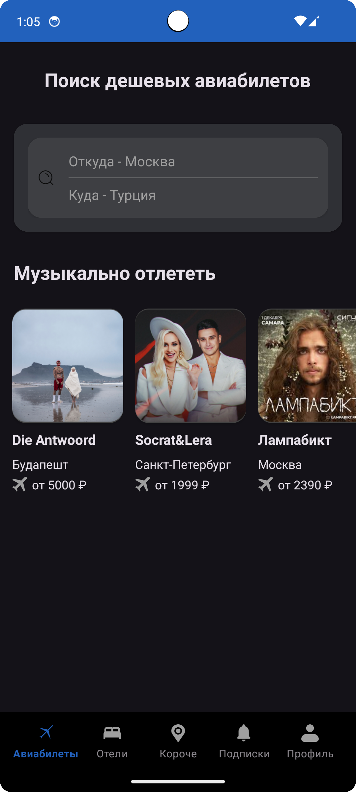
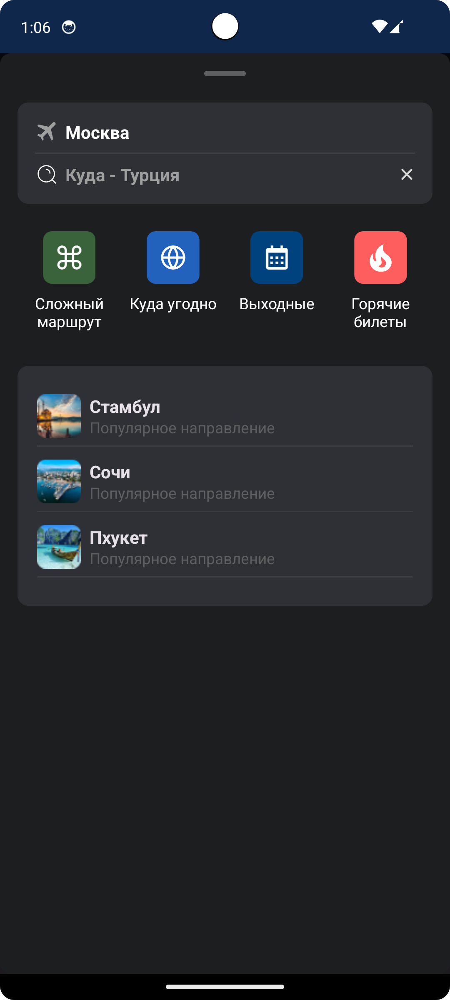
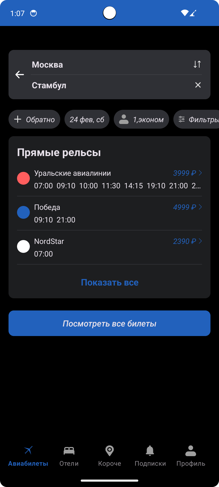

# Effective mobile test
> Тестовое задание Effective mobile

## Скриншоты
  

# Stack
### Architecture:
- Clean architecture
- Multi modules
- MVVM

### UI:
- XML
- AdapterDelegates
- Cicerone
- Material 2
- AppCompat

### DI:
- Dagger

### Asynchrony:
- Coroutine
- Flow

### Network:
- Retrofit
- Gson

### Storage:
- Room
  
### Other:
- Kotlin
- Android SDK
